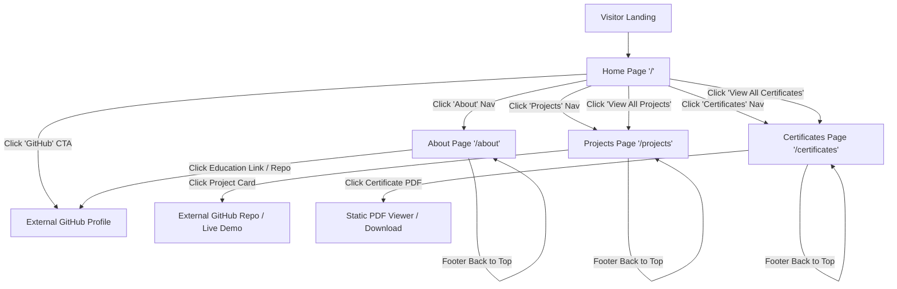

# Application & User Flow (Appflow) — Bhagath Pranav Portfolio

## 1. Overview & Sitemap Flowchart

The website user journey is streamlined for recruiters, engineering leads, and technical reviewers. All core pages are accessible via the sticky navigation bar or contextual home CTAs.

---

## 2. Page-by-Page Detailed User Journeys

### 2.1 Journey A: Recruiter Quick Evaluation (`/` Home)
1. **Entry**: Visitor lands on `https://bhagathpranav.vercel.app/` (or Cloudflare URL).
2. **Hero View**: Visitor reads Bhagath Pranav's tagline ("Data analytics & SQL-focused developer..."), views profile avatar, and identifies primary domain expertise.
3. **Featured Teaser**: Visitor scrolls to view 3 featured project teasers (*AI-chart*, *Customer Shopping Analysis*, *Zepto E-Commerce SQL*).
4. **Certificate Snapshot**: Visitor sees recent AWS & DataCamp badges.
5. **Action**: Visitor clicks "Explore All Projects →" or "View GitHub".

### 2.2 Journey B: Technical Recruiter Deep-Dive (`/projects`)
1. **Entry**: Visitor clicks "Projects" in sticky header navigation.
2. **Grid View**: Visitor browses responsive cards displaying 9+ GitHub projects categorized by technologies (`SQL`, `Python`, `TypeScript`, `Astro`, `MERN`).
3. **Card Interaction**: Visitor hovers over a project card (e.g., *Customer Shopping Behavior Analysis*). Card border turns red.
4. **Action**: Visitor clicks "View Project" or "Live Demo" button. Direct navigation opens GitHub repository in a new browser tab (`target="_blank"`).

### 2.3 Journey C: Credentials Verification (`/certificates`)
1. **Entry**: Visitor clicks "Certificates" in navigation.
2. **Catalog View**: Visitor reviews 20+ certificates spanning Cloud Computing, Prompt Engineering, Data Analytics, and Patent Publications.
3. **Category Filtering**: Visitor selects a category filter (e.g., "Cloud & GenAI" or "Data Analytics").
4. **PDF Inspection**: Visitor clicks "View Certificate PDF". Browser opens original PDF file directly from `/public/certificates/`.

### 2.4 Journey D: Bio & Education Review (`/about`)
1. **Entry**: Visitor clicks "About".
2. **Bio Reading**: Visitor reads Bhagath's analytics focus, SQL problem-solving capabilities, and static web craft.
3. **Capabilities Breakdown**: Visitor reviews the 4-step "What I Do" numbered list.
4. **Timeline Check**: Visitor inspects education and independent development highlights.

---

## 3. Edge Cases & Fallback Behaviors

| Edge Case Condition | System Behavior / Fallback |
| :--- | :--- |
| **GitHub Avatar Image Fails** | `avatarAlt` text renders; browser loads default profile placeholder SVG from `/images/placeholder-profile.svg`. |
| **Project Preview Thumbnail Missing** | `ProjectCard.astro` falls back to a clean 300x200 placeholder container with standard black/red border styling. |
| **PDF Certificate File Missing** | Build-time script `scripts/copy-certificates.js` verifies file presence before static compilation, preventing 404 links. |
| **Non-existent Route / 404** | Cloudflare Pages serves default static 404 page redirecting user back to `/`. |
