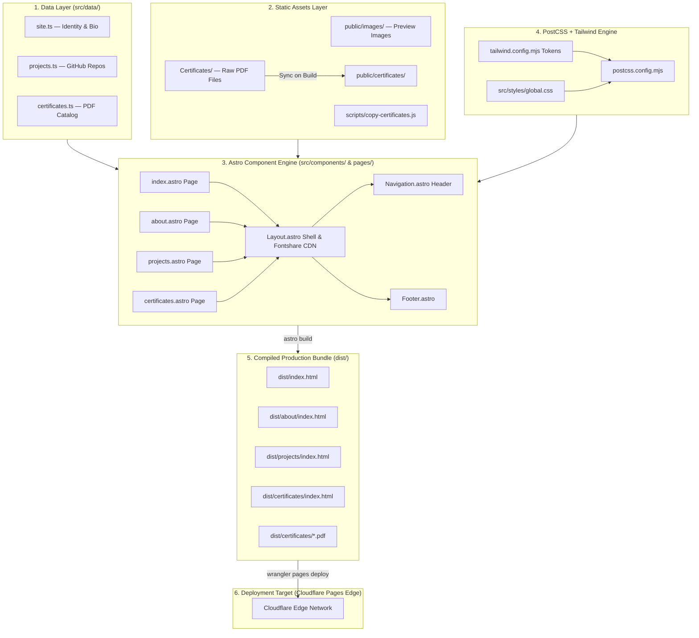

# Architecture Overview (Architecture.md) — Bhagath Pranav Portfolio

## 1. High-Level Architecture Diagram

The **Bhagath Pranav Portfolio** application uses a decoupled, data-driven static site generation (SSG) model. TypeScript content modules feed into Astro component templates, which compile into pure HTML, CSS, and static PDF assets for Cloudflare Edge delivery.

---

## 2. Architectural Design Decisions & Rationale

### 2.1 Astro 6 Static Generator (`output: 'static'`)
* **Decision**: Use Astro set exclusively to static output mode.
* **Rationale**: Eliminates cold starts, database query latencies, server vulnerabilities, and hosting costs. Delivers maximum performance for portfolio presentation.

### 2.2 Direct PostCSS Tailwind CSS v3 Integration
* **Decision**: Integrate Tailwind CSS v3 directly through PostCSS (`postcss.config.mjs`) instead of using `@astrojs/tailwind`.
* **Rationale**: Bypasses the peer dependency version gap between Astro 6 and the official Astro Tailwind integration plugin while keeping build output fast and reliable.

### 2.3 Standalone Pre-Build Asset Synchronization Hook
* **Decision**: Run `node scripts/copy-certificates.js` before `astro build` and `astro dev`.
* **Rationale**: Maintains a clean source-of-truth directory `/Certificates` in root while seamlessly syncing PDF assets into `/public/certificates/` for Astro's static asset router.

### 2.4 Strict 3-Color Editorial Visual Palette
* **Decision**: Restrict color palette to Black (`#000000`), White (`#FFFFFF`), and Red (`#FF1A1A`).
* **Rationale**: Establishes a bold editorial aesthetic that highlights data analytics capabilities and clean typography without relying on complex UI libraries or visual fluff.

---

## 3. Data & Presentation Decoupling

The repository enforces a strict unidirectional data pipeline:

1. **Content Definition**: Data is maintained in typed TypeScript files (`site.ts`, `projects.ts`, `certificates.ts`).
2. **Template Ingestion**: Astro pages load data modules during static build time (`Astro.glob` or standard ESM imports).
3. **Markup Generation**: Components render semantic HTML strings containing predefined CSS classes.
4. **Zero Runtime Hydration**: HTML is rendered directly to the browser without client JS runtime hydration.
