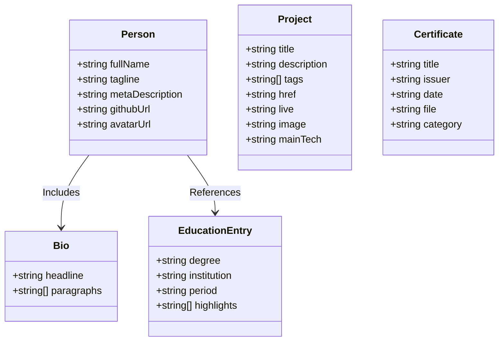

# Data Schema & Content Specification (Schema.md) — Bhagath Pranav Portfolio

## 1. Overview

All data consumed across the **Bhagath Pranav Portfolio** application is strictly typed using TypeScript interfaces and stored statically in `src/data/`. This decoupled architecture allows instant data updates without modifying layout templates or component markup.

---

## 2. Interface Definitions & Schemas

### 2.1 Person Identity Schema (`src/data/site.ts`)

Defines portfolio identity, social profiles, recruiter tagline, and metadata tags.

```typescript
export interface Person {
  /** Full legal / display name */
  fullName: string;
  
  /** One-line high-impact hook for recruiters */
  tagline: string;
  
  /** Default HTML head meta description */
  metaDescription: string;
  
  /** GitHub account username */
  githubUsername: string;
  
  /** Complete GitHub profile URL */
  githubUrl: string;
  
  /** Avatar profile image URL */
  avatarUrl: string;
  
  /** Accessible alt text for avatar image */
  avatarAlt: string;
}
```

### 2.2 Bio Schema (`src/data/site.ts`)

Defines professional summary content displayed on the `/about` page.

```typescript
export interface Bio {
  /** High-level headline statement */
  headline: string;
  
  /** Paragraphs detailing technical experience & philosophy */
  paragraphs: string[];
}
```

### 2.3 Education Entry Schema (`src/data/site.ts`)

Defines academic credentials, certifications, and independent career milestones.

```typescript
export type EducationEntry = {
  /** Degree title or role description */
  degree: string;
  
  /** Institution, company, or platform name */
  institution: string;
  
  /** Time period or date range (e.g. "Present", "2022 - 2026") */
  period: string;
  
  /** Bullet points highlighting achievements */
  highlights?: string[];
};
```

### 2.4 Project Schema (`src/data/projects.ts`)

Defines projects displayed on `/`, `/projects`, and featured teasers.

```typescript
export type Project = {
  /** Project display title */
  title: string;
  
  /** One-line concise summary of analytics or web craft */
  description: string;
  
  /** Array of tech stack tags (e.g. ['SQL', 'Python', 'Pandas']) */
  tags: string[];
  
  /** GitHub repository URL */
  href: string;
  
  /** Optional live production deployment URL */
  live?: string;
  
  /** Optional preview image path (e.g. '/images/zepto_preview.png') */
  image?: string;
  
  /** Primary technology badge (e.g. 'SQL', 'Python', 'TypeScript') */
  mainTech?: string;
};
```

### 2.5 Certificate Schema (`src/data/certificates.ts`)

Defines credential metadata, PDF asset paths, and credential categories.

```typescript
export interface Certificate {
  /** Certificate or patent publication title */
  title: string;
  
  /** Issuing organization (e.g., 'AWS', 'DataCamp', 'Patent Office, Government of India') */
  issuer: string;
  
  /** Issue date string (e.g., 'May 2026', 'Sept 2025') */
  date: string;
  
  /** Relative path to copied static PDF asset (e.g., '/certificates/23881A1275.pdf') */
  file: string;
  
  /** Category tag for filtering ('Cloud & GenAI' | 'Data Analytics' | 'Development' | 'Internship & Patent') */
  category: string | string[];
}
```

---

## 3. Schema Relationships & Module Imports


